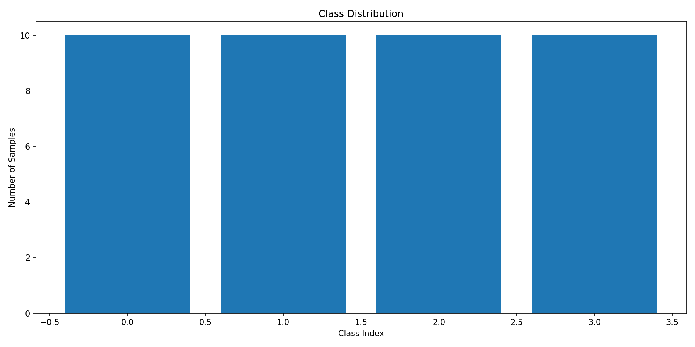

# Data Audit Report

- **Total Classes:** 4
- **Total Samples:** 40

## Class Distribution

### Classes with < 20 samples
- `anoo`: 10 samples
- `a`: 10 samples
- `ana`: 10 samples
- `ka`: 10 samples

## Data Quality Issues
- **Corrupted Images:** 0
- **Channel Inconsistencies:** 0
- **Degenerate (low variance) Images:** 5
- **Within-class Duplicates:** 0
- **Cross-class Duplicates:** 0

## Metadata
- **Writer Metadata Found:** False
- **Details:** No writer metadata files found.
