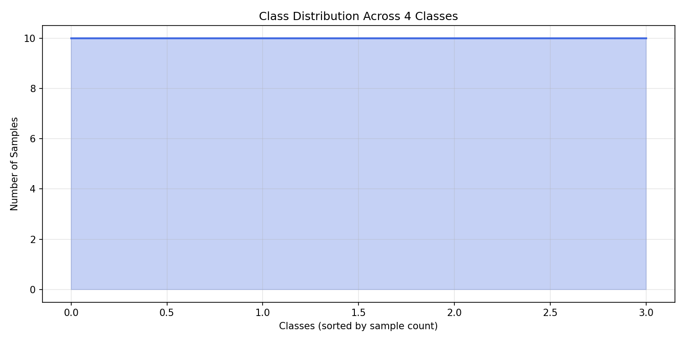

# Phase 0 — Data Audit Report

- **Total Classes:** 4
- **Total Images:** 40
- **Min Samples/Class:** 10
- **Max Samples/Class:** 10
- **Average Samples/Class:** 10.0

## Class Distribution

### Classes with < 20 Samples
- `hallulu/ana`: 10 samples
- `hallulu/ka`: 10 samples
- `Guninthamulu/ana/anoo`: 10 samples
- `achulu/a`: 10 samples

## Data Quality (Sampled Integrity Check)
- **Images Sampled:** 40
- **Corrupted Images:** 0
- **Channel Inconsistencies:** 0
- **Low-Variance / Degenerate Images:** 5

## Writer Metadata
- **Found:** False
- **Details:** No writer metadata files found (stratified split applied).
